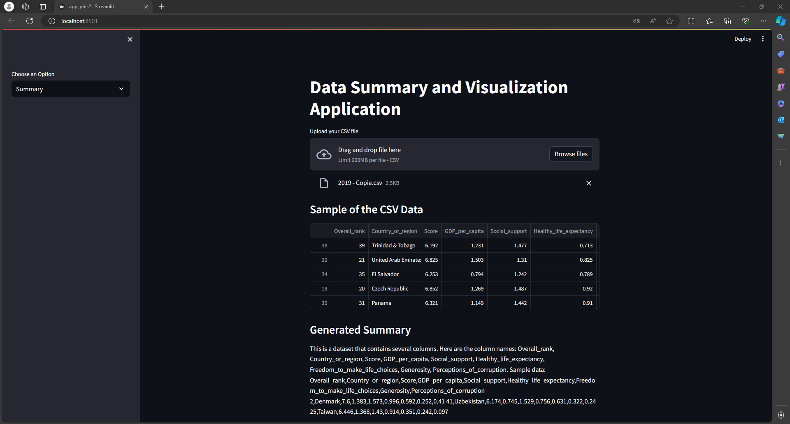
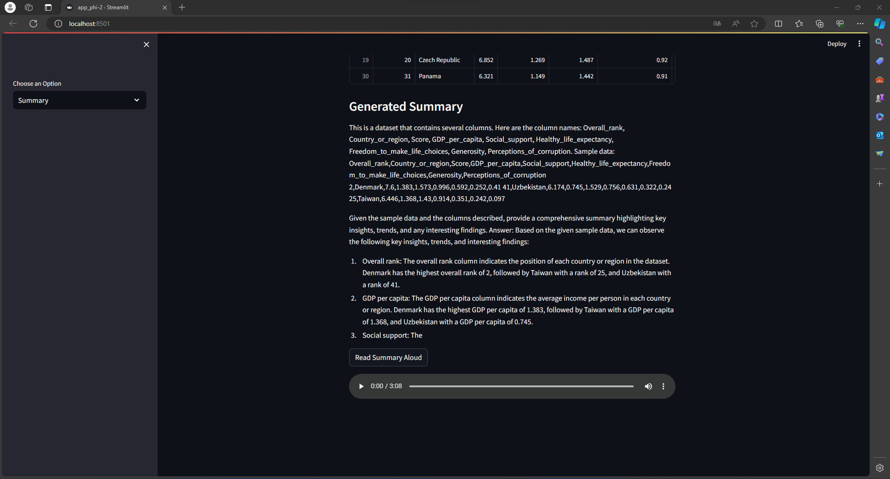
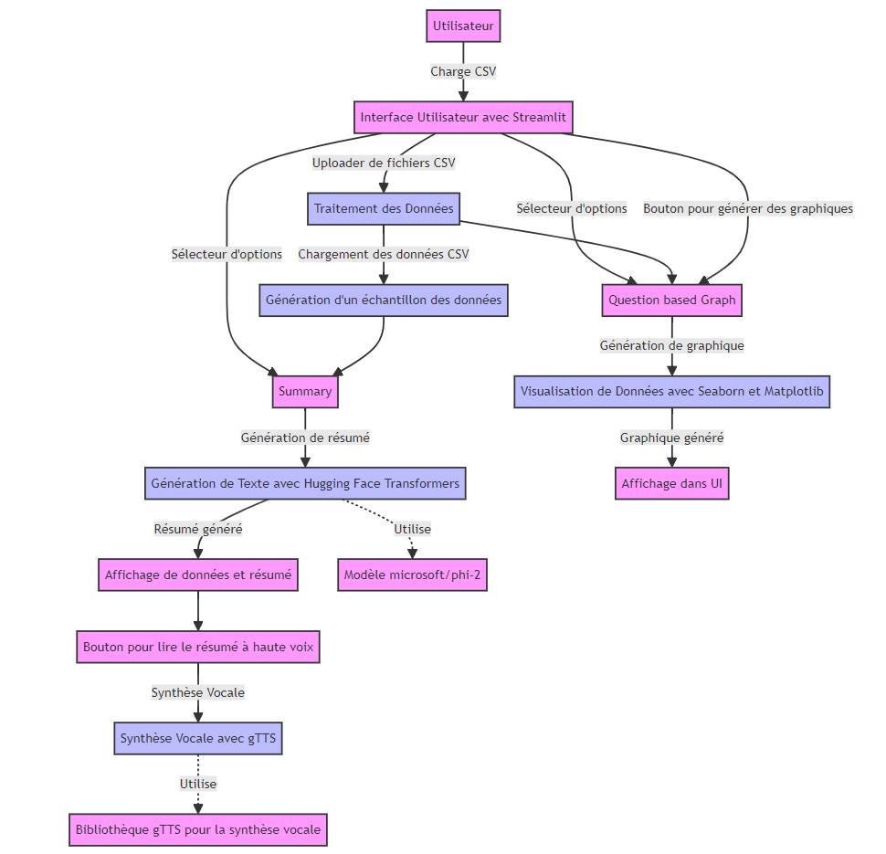

# ML_Project

# Application de Résumé et de Visualisation de Données

Cette application, construite avec Streamlit et l'API de Hugging Face Transformers, permet de générer des résumés textuels à partir de données tabulaires et de visualiser ces données sous forme de graphiques. De plus, elle offre la possibilité d'écouter le résumé généré grâce à une fonctionnalité de synthèse vocale.

## Fonctionnalités

- **Génération de Résumé** : Crée un résumé textuel basé sur un échantillon du dataset.
- **Visualisation Graphique** : Génère un graphique représentant la distribution des données.
- **Synthèse Vocale** : Lit à haute voix le résumé généré.

## Technologies Utilisées

- Python
- Streamlit
- Hugging Face Transformers
- Seaborn
- Google Text-to-Speech (gTTS)

## Installation

Pour exécuter cette application, vous aurez besoin de Python et de quelques bibliothèques spécifiques. Voici les étapes à suivre pour installer les dépendances :

1. Clonez le dépôt ou téléchargez les fichiers source.
2. Installez les dépendances requises en exécutant :

```bash
pip install streamlit transformers pandas seaborn Pillow gtts
```

## Utilisation

Pour lancer l'application, naviguez vers le dossier contenant le script et exécutez :

```bash
streamlit run app_phi-2.py
```

Une fois l'application lancée, vous pouvez :

- Charger un fichier CSV via l'interface utilisateur.
- Sélectionner une action à effectuer avec les données chargées :
  - Résumé : Génère un résumé basé sur les données.
  - Graphique basé sur une Question : Crée un graphique représentant la distribution d'une colonne spécifique.

## Captures du projet




[Écouter l'audio](https://ueve-my.sharepoint.com/:u:/g/personal/20184149_etud_univ-evry_fr/EVuE-1jJ0_hNq04hte5Wx64BEfjJPTa8eB8C9mXoBqiRKg?e=q05k3o)

## Schéma cas d'utilisation


